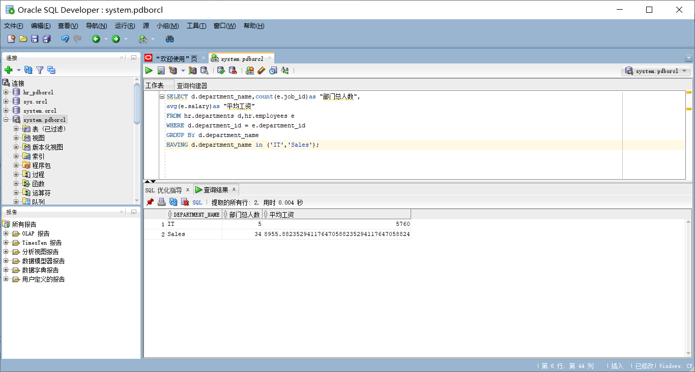
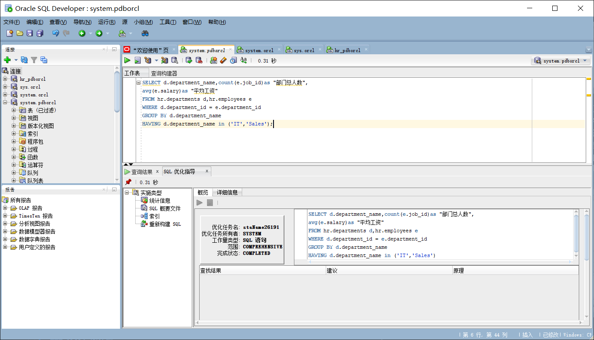
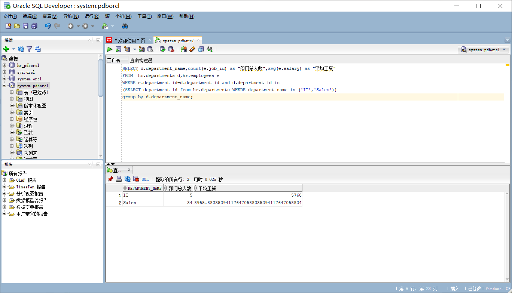

# 实验一：SQL语句的执行计划分析与优化指导

## 软工二班-201810414221-吴俊成

### 实验目的

#### 分析SQL执行计划，执行SQL语句的优化指导。理解分析SQL语句的执行计划的重要作用

### 实验内容

* 对Oracle12c中的HR人力资源管理系统中的表进行查询与分析

* 首先运行和分析教材中的样例：本训练任务目的是查询两个部门('IT'和'Sales')的部门总人数和平均工资，以下两个查询的结果是一样的。但效率不相同

* 设计自己的查询语句，并作相应的分析，查询语句不能太简单

### 查询教材中的内容

#### 代码一

```set autotrace on

SELECT d.department_name,count(e.job_id)as "部门总人数",
avg(e.salary)as "平均工资"
from hr.departments d,hr.employees e
where d.department_id = e.department_id
and d.department_name in ('IT','Sales')
GROUP BY d.department_name;
```

#### 代码一运行结果如图


#### 结果分析：该查询语句通过从两个部门来查询部门的总人数和平均工资，通过创建一个或多个索引可以改进此语句的执行计划。建议考虑运行可以改进物理方案设计的访问指导或者创建推荐的索引。原理是创建推荐的索引可以显著地改进此语句的执行计划。但是，使用典型的SQL工作量运行“访问指导”可能比单个语句更可取。通过这种方法可以获得全面的索引建议案，包括计算索引维护的开销和附加的空间消耗


#### 代码二

```set autotrace on

SELECT d.department_name,count(e.job_id)as "部门总人数",
avg(e.salary)as "平均工资"
FROM hr.departments d,hr.employees e
WHERE d.department_id = e.department_id
GROUP BY d.department_name
HAVING d.department_name in ('IT','Sales');
```

#### 代码二运行结果如图



#### 结果分析：该查询语句同样是通过员工表employees和部门表departments来查询部门的总人数和平均工资，并按照部门名'IT'和'Sales'进行分组查询。判断部门ID和员工ID是否对应，由having确认部门名字是IT和sales来查询部门总人数和平 均工资。 由于使用了WHERE和HAVING进行了两次过滤，结果更加精准，所以该查询语句比第一条查询语句要好一点，目前没有优化建议



### 优化代码

```set autotrace on

SELECT d.department_name,count(e.job_id) as "部门总人数",avg(e.salary) as "平均工资"
FROM  hr.departments d,hr.employees e
WHERE e.department_id=d.department_id and d.department_id in 
(SELECT department_id from hr.departments WHERE department_name in ('IT','Sales')) 
group by d.department_name;
```

#### 分析：该查询语句在语句一的基础上进行了优化，将查询的条件部门名'IT'和'Sales'换成对应部门的id进行查询，使用部门名查询对应的部门id作为子查询而得到的结果作为外层查询条件，这样来查询结果的准确性更高，查询效率也更高

#### 运行结果如图


